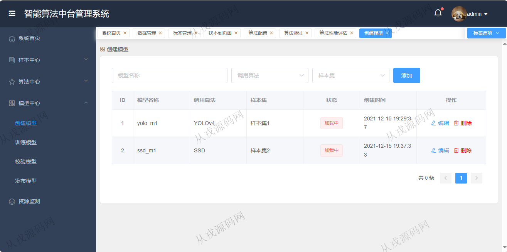
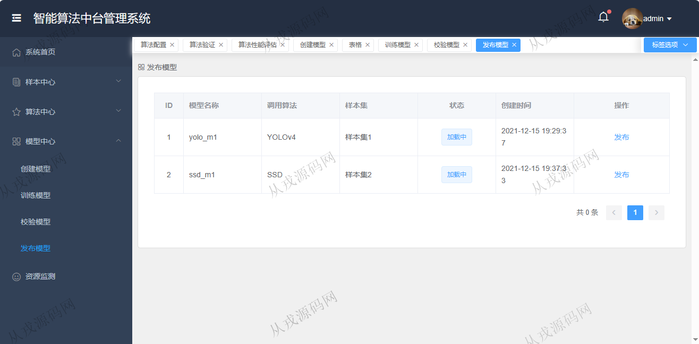

<h1 align="center">186.智能算法中台管理系统</h1>

 获取sql文件 QQ: 386869957 QQ群: 377586148 

 [更多源码项目: 从戎源码网](https://armycodes.com/) 

## 简介

> 本代码来源于网络,仅供学习参考使用!
>
> 提供1.远程部署/2.修改代码/3.设计文档指导/4.框架代码讲解等服务
>
> http://localhost:3000/#/login
>
> admin 123123
>

## 项目介绍
基于springboot+vue3的智能算法中台管理系统：前端 vue、element-plus，后端 maven、springmvc、spring、mybatis；集成数据管理、标签管理、算法配置、模型中心等功能于一体的系统。

## 功能介绍

- 系统首页：当前最优模型表现，待办事项，样本数量，训练完成模型数量，训练中模型数量
- 数据管理：数据集增删改查，数据集导入，按数据集名称模糊搜索，按标注类型搜索
- 标签管理：标签信息的增删改查，按标签组名称和描述模糊搜索
- 算法配置：算法信息的增删改查，多条件搜索，启用，停用
- 算法验证：状态显示，开始训练操作
- 算法性能评估：启用，停用，详情查看
- 模型中心：创建模型，训练模型，校验模型，发布模型

## 环境

- <b>IntelliJ IDEA 2021.3</b>

- <b>Mysql 5.7.26</b>

- <b>Node 14.14.0</b>

- <b>JDK 1.8</b>

## 运行截图

